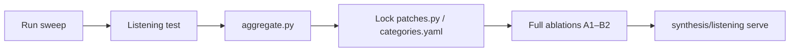

# Experiments

Offline parameter sweeps and tuning runs. Experiment **code and config** live here; large **audio outputs** live on deepfreeze with in-repo symlinks.

**Goal:** pick **per-category** winners (piano, strings, brass, drums, …) for both Slakh patch pools and SA3 realify presets — not a single global setting for all instruments.

**Tuning docs:** [`TUNING.md`](TUNING.md) — shared methodology, staged Slakh plan, preset sweep scope, result-recording conventions.

## Layout

```
experiments/
├── README.md
├── TUNING.md                 # methodology for patch + preset tuning
├── probe_stems.yaml          # shared probe set (24 stems: 3 per category × 8)
├── listening/                # sweep listening-test server (port 8766)
├── listening_shared/         # shared 0–100 slider UI + scale helpers
├── ablation_listening/       # Test 1: A1–B2 dataset comparison (port 8767)
├── model_listening/          # Test 2: SAO downstream comparison (port 8768)
├── patch_sweep/              # Slakh: soundfonts, FX, program pools
│   └── soundfonts.yaml       # candidate GM banks (phase 1)
└── preset_sweep/             # SA3 init_noise_level + prompt tuning
```

## Setup

After clone, create dev artifact symlinks (includes sweep outputs):

```bash
uv run python -m shared.setup_symlinks
```

## Workflow



### Stage 1 — Run sweeps

```bash
# Patch pools (CPU; define PATCH_POOLS first)
uv run python -m experiments.patch_sweep.sweep -j 8

# SA3 presets (GPU)
uv run python -m experiments.preset_sweep.sweep --phase phase1_noise
```

### Stage 2 — Listening test

```bash
uv run python -m experiments.listening.serve --sweep preset
uv run python -m experiments.listening.serve --sweep patch
```

Open [http://127.0.0.1:8766](http://127.0.0.1:8766). Rate each blinded variant on content (1–5) and realism (1–5). Export JSON when done.

### Stage 3 — Aggregate winners

```bash
uv run python -m experiments.listening.aggregate \
  --sweep preset \
  --responses responses_preset.json \
  --output experiments/preset_sweep/results_notes.md
```

Update production configs from results.

### Stage 4 — Validation ablation comparison

```bash
uv run python -m synthesis.listening.serve
```

Compare locked configs across A1–B2 (port 8765).

### Stage 5 — Formal listening tests (0–100 scale)

**Test 1 — dataset ablation (A1–B2):**

```bash
uv run python -m experiments.ablation_listening.prepare_clips
uv run python -m experiments.ablation_listening.serve --host 0.0.0.0 --port 8767
# ngrok http 8767
uv run python -m experiments.ablation_listening.aggregate \
  --responses experiments/ablation_listening/output/responses/responses_*.json \
  --output experiments/ablation_listening/output/results_notes.md
```

**Test 2 — SAO downstream:** see [`model_listening/README.md`](model_listening/README.md) (populate after training).

Shared UI and ngrok notes: [`listening_shared/README.md`](listening_shared/README.md).

- [`TUNING.md`](TUNING.md) — overall methodology (start here)
- [`patch_sweep/GUIDE.md`](patch_sweep/GUIDE.md) — **step-by-step Slakh tuning runbook**
- [`patch_sweep/soundfonts.yaml`](patch_sweep/soundfonts.yaml) — candidate soundfont catalog
- [`preset_sweep/GUIDE.md`](preset_sweep/GUIDE.md) — **step-by-step SA3 preset tuning runbook**
- [`preset_sweep/README.md`](preset_sweep/README.md) — phased preset grids and lock target
- [`listening/README.md`](listening/README.md)
