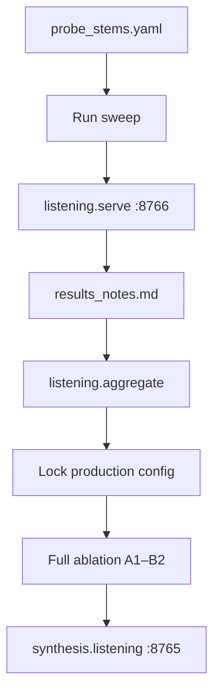

# Tuning methodology

How we pick production rendering settings for sPDMX ablations **A2** (basic + realify) and **B1/B2** (slakh + realify). Both sweeps share the same probe stems and listening infrastructure; they optimize different parts of the pipeline.

## Design principle: per-category winners

Neither sweep picks one global winner. Probe stems in [`probe_stems.yaml`](probe_stems.yaml) are tagged with a `category` (piano, strings, wind, drums, …). The listening test rates variants stem-by-stem; [`listening/aggregate.py`](listening/aggregate.py) reports the best variant **within each category**.

| Sweep | What varies | Locked in production |
|-------|-------------|----------------------|
| **Patch** (Slakh) | Fluidsynth soundfont shortlists, FX | [`experiments/patch_sweep/winners_locked.yaml`](patch_sweep/winners_locked.yaml) → `SLAKH_CATEGORY_RENDER` |
| **Preset** (SA3) | Phased: `init_noise_level` → prompt → diffusion | [`synthesis/realify/presets/categories.yaml`](../synthesis/realify/presets/categories.yaml) |

Categories with multiple probe stems (3 per category) vote on the same winner via mean realism/content across stems.

## Shared workflow



1. **Tune** — render variants on the 24-stem probe set (3 per category; [`patch_sweep/`](patch_sweep/), [`preset_sweep/`](preset_sweep/))
2. **Evaluate** — blinded listening test ([`listening/`](listening/)); rate **content** (melody/rhythm/timing) and **realism**
3. **Aggregate** — per-category winners → `results_notes.md`
4. **Lock** — merge winners into `patches.py` or `categories.yaml`
5. **Validate** — full 100-song ablation + [`synthesis/listening`](../synthesis/listening/) comparison across A1–B2

Document decisions in each sweep’s `results_notes.md` as you go (winners, rejects, held-out checks).

### Blinded listening (all phases)

Each phase uses the same **blinded** listening test at port **8766**. You never see soundfont names or FX settings during rating — only **Sample A / B / C** in randomized order per stem.

```bash
# After a phase sweep finishes:
uv run python -m experiments.listening.serve --sweep patch \
  --patch-sweep-dir experiments/patch_sweep/output/phase1_soundfonts

# Open http://127.0.0.1:8766/test?type=patch

# When done, export JSON from the UI, then:
uv run python -m experiments.listening.aggregate \
  --sweep patch \
  --responses experiments/patch_sweep/output/phase1_soundfonts/responses/responses_....json \
  --output experiments/patch_sweep/results_notes.md
```

**What you rate (per sample vs reference):**

| Scale | Question |
|-------|----------|
| Content (1–5) | Same melody, rhythm, timing as reference? |
| Realism (1–5) | Sounds like a realistic, appropriate instrument? |

**How winners are picked** (`aggregate.py`):

- **Phase 1 (noise):** drop variants with mean content **< 4.5**; among survivors, pick highest mean realism; ties → higher `init_noise_level`.
- **Phase 2+ (prompt / diffusion):** content gate (min ≥ 3, mean ≥ 3.5) + highest mean realism.

Variant IDs stay in the exported JSON for aggregation only; the UI shows blind labels.

| Phase | `variant_id` encodes | Reference | Separate output dir |
|-------|---------------------|-----------|-------------------|
| 1 — Soundfonts | `sgm_v2`, `generaluser`, … | A1 basic | `output/phase1_soundfonts/` |
| 2 — FX | `fx_dry`, `fx_light`, `fx_warm` | A1 basic | `output/phase2_fx/` |

Phase 1 tip: content scores should be ~equal (same MIDI, different bank) — **realism** is the main signal.

---

## Patch sweep (Slakh / B1)

**Goal:** make `--render-mode slakh` audibly and meaningfully different from `basic`, approximating [Slakh2100](http://www.slakh.com/) stem diversity without Kontakt VSTs.

### Slakh-style variety

1. **Per listening category** (after tuning + lock) — each category gets a **soundfont shortlist** and FX profile (`winners_locked.yaml` → `SLAKH_CATEGORY_RENDER`).
2. **Per song, within a category** — production slakh mode randomly picks one soundfont from the shortlist per (song, category), seeded by `(sample_seed, song_path, category)`. MIDI programs stay unchanged.

Complete phases 1–2 and run `patch_sweep.lock` to enable B1 variety. Until `winners_locked.yaml` exists, `--render-mode slakh` behaves like basic.

Slakh uses 187 professional sample patches in ~34 GM classes. Our Fluidsynth approximation:

- **Soundfont shortlists** — multiple GM banks per category for timbral diversity
- **FX** — light reverb/EQ (post-fluidsynth or fluidsynth flags), applied after soundfont is chosen

### Staged tuning (do not skip ahead)

| Phase | What we compare | Status |
|-------|-----------------|--------|
| **1 — Soundfonts** | 7 candidate banks, dry render, shortlist ≥4.1 mean rating | **In progress** |
| **2 — FX** | Light reverb/EQ profiles on phase-1 shortlists | Pending |
| **3 — Production lock** | Per-category shortlists + FX → B1 ablation (100 songs) | Pending |

See [`patch_sweep/GUIDE.md`](patch_sweep/GUIDE.md) for the **step-by-step runbook** and [`patch_sweep/soundfonts.yaml`](patch_sweep/soundfonts.yaml) for the soundfont catalog.

### Reference anchor in listening test

Patch sweep reference = **A1 basic** synthesis (same probe stem, no slakh randomization).

---

## Preset sweep (SA3 realify / A2)

**Goal:** find SA3 audio-to-audio settings that improve timbre realism while preserving musical content, per instrument category.

### Staged tuning (do not skip ahead)

| Phase | What we compare | Status |
|-------|-----------------|--------|
| **1 — Noise** | 5 `init_noise_level` values, fixed `current` prompt | Pending |
| **2 — Prompts** | 3 prompt variants on phase-1 noise winners | Pending |
| **3 — Diffusion** | 3 steps×cfg profiles (optional) | Pending |
| **4 — Production lock** | Per-category winners → A2 ablation (100 songs) | Pending |

See [`preset_sweep/GUIDE.md`](preset_sweep/GUIDE.md) for the **step-by-step runbook** and [`preset_sweep/grids/`](preset_sweep/grids/) for phase grids.

### What we vary

| Parameter | Phase | Grid values | Fixed |
|-----------|-------|-------------|-------|
| `init_noise_level` | 1 | 0.25, 0.35, 0.45, 0.55, 0.65 | prompt=`current`, steps=8, cfg=1.0 |
| `prompt_variant` | 2 | `current`, `minimal`, `preservation` | noise from phase 1 |
| `steps` / `cfg_scale` | 3 (optional) | 3 diffusion profiles | noise + prompt from phases 1–2 |
| SA3 model | — | — | `medium` (post-trained) |

Phase 1: drop noise levels with mean content < 4.5; pick highest realism among survivors. Phase 2: content gate strict, highest realism. Phase 3: fine-tuning only if needed.

| Phase | `variant_id` encodes | Reference | Separate output dir |
|-------|---------------------|-----------|-------------------|
| 1 — Noise | `noise0.45`, … | A1 raw | `output/phase1_noise/` |
| 2 — Prompts | `current`, `minimal`, … | A1 raw | `output/phase2_prompts/` |
| 3 — Diffusion | `steps8_cfg1.0`, … | A1 raw | `output/phase3_diffusion/` |

### What we do *not* vary in this sweep

- Source stems (always A1 `basic` ablation)
- Caption generation pipeline (except prompt variant in phase 2)
- Chunking / batch size / GPU worker layout

### Reference anchor in listening test

Preset sweep reference = **A1 raw** (unrealified basic stem).

### Production target

Per-category overrides in [`synthesis/realify/presets/categories.yaml`](../synthesis/realify/presets/categories.yaml). Lock via `uv run python -m experiments.preset_sweep.lock`.

See [`preset_sweep/README.md`](preset_sweep/README.md).

---

## Probe set

[`probe_stems.yaml`](probe_stems.yaml) — **24 stems** (3 per category × 8 categories). Shared by both sweeps so patch and preset winners are comparable across categories. Each stem is validated against its MIDI `program_change` at sweep startup (e.g. voice stems must use choir/voice GM programs, not piano placeholders).

---

## Outputs and symlinks

Sweep audio lives on deepfreeze; in-repo symlinks via `uv run python -m shared.setup_symlinks`:

| Sweep | Deepfreeze path | Repo symlink |
|-------|-----------------|--------------|
| Patch | `{OUTPUT_DIR}/dev/experiments/patch_sweep/` | `experiments/patch_sweep/output/` |
| Preset | `{OUTPUT_DIR}/dev/experiments/preset_sweep/` | `experiments/preset_sweep/output/` |

Soundfont library: `soundfonts/` → `/data3/pnlong/soundfonts` (see [`patch_sweep/soundfonts.yaml`](patch_sweep/soundfonts.yaml)).

---

## Recording results

Each sweep has a `results_notes.md` template. After listening:

```bash
uv run python -m experiments.listening.aggregate \
  --sweep patch \
  --responses responses_patch.json \
  --output experiments/patch_sweep/results_notes.md
```

Fill in notes column with *why* a variant won or lost — future you (and the aggregate step) needs the reasoning, not just the scores.
