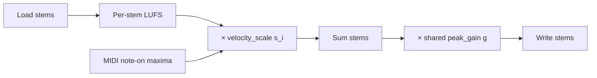

# Mixing and stem summability

Canonical description of the post-render mixing / stem-normalization pipeline used for sPDMX. Operational CLI notes live in [`RENDERING_NOTES.md`](RENDERING_NOTES.md); implementation is in [`audio.py`](audio.py), [`velocity.py`](velocity.py), and [`mix.py`](mix.py).

## Motivation

Fluidsynth (and neural backends) already encode MIDI velocity in each rendered stem. If we then **independently** loudness-normalize every stem to the same integrated target (e.g. −23 LUFS), cross-stem dynamic relationships are lost: a track meant to sit at piano can be boosted to the same loudness as a forte lead.

Released stems should also remain **linearly summable**: the mixture is exactly the sample-wise sum of the stems. That makes a separate on-disk `mixture.*` optional (the mix is cheap to recompute).

The mix pass therefore applies three gains, multiplied in order:

\[
\tilde{x}_i = g \cdot s_i \cdot \mathrm{LUFS}(x_i)
\]

where \(x_i\) is stem \(i\), \(\mathrm{LUFS}(\cdot)\) is per-stem loudness normalization, \(s_i\) restores relative MIDI dynamics, and \(g\) is a single anti-clip factor shared by all stems.

## Pipeline



### 1. Per-stem loudness normalization

- Standard: **BS.1770-4** integrated loudness via `pyloudnorm`
- Target: **−23 LUFS** (`TARGET_LOUDNESS_LUFS`)
- Per-stem peak cap at **1.0** (`MIXTURE_PEAK_LIMIT`) so sparse MIDI stems are not driven into clipping by unlimited LUFS gain
- Stems are zero-padded to a common length before later stages
- Sample rate: **44.1 kHz**; channel layout: `STEM_CHANNELS` (default mono)

Synthesis and realify write **raw** stems (no LUFS). Loudness, velocity dynamics, and summability normalization are a separate pass:

### 2. MIDI velocity dynamics

After LUFS, multiply stem \(i\) by

\[
s_i = \frac{v_i^{\max}}{v_{\mathrm{song}}^{\max}}
\]

where \(v_i^{\max}\) is the maximum **note-on** velocity with \(\mathrm{velocity} > 0\) on MIDI track \(i\), and \(v_{\mathrm{song}}^{\max} = \max_i v_i^{\max}\).

Edge cases:

| Case | Scale |
|------|--------|
| Track with no note-ons | \(s_i = 0\) |
| Song with no note-ons (\(v_{\mathrm{song}}^{\max} = 0\)) | \(s_i = 1\) for all tracks (leave dynamics untouched) |

MIDI is resolved from the ablation song directory by mirroring PDMX layout: `…/data/a/b/Qm…` → `{PDMX_ROOT}/mid/a/b/Qm….mid`. When dense corrected MIDI is enabled, the corrected file is used so track indices match `stems.csv`. Future synthesis runs also persist `max_velocity` and `velocity_scale` on `stems.csv`; the mix pass prefers those columns when present.

This term does **not** re-render audio from MIDI. Fluidsynth already baked velocity into the waveform; \(s_i\) only undoes the flattening introduced by independent LUFS.

### 3. Uniform anti-clip (Slakh-style)

Sum the velocity-scaled stems sample-wise. Let \(p\) be the peak absolute sample of the sum. The shared gain is

\[
g = \begin{cases}
1 / p & \text{if } p > 1 \\
1 & \text{otherwise}
\end{cases}
\]

(with peak limit 1.0). The **same** \(g\) is applied to every stem so \(\sum_i \tilde{x}_i\) stays peak-limited and stems remain summable.

### 4. Write

- Overwrite stem files with \(\tilde{x}_i\) (default; confirmation prompt unless `-y`)
- Optionally write `mixture.*` (`--write-mixture`); otherwise consumers form the mix as \(\sum_i \tilde{x}_i\)
- `--no-overwrite` writes a sibling tree `{ablation}_summable/` instead of replacing source stems

## Constants

| Symbol / name | Value | Config |
|---------------|-------|--------|
| Sample rate | 44.1 kHz | `SAMPLE_RATE` |
| Loudness target | −23 LUFS | `TARGET_LOUDNESS_LUFS` |
| Peak limit | 1.0 | `MIXTURE_PEAK_LIMIT` |
| Stem channels | 1 (mono) by default | `STEM_CHANNELS` |

## CLI

```bash
# In-place (prompts before overwrite)
uv run python -m synthesis.mix --render-mode basic -j 8

# Preview tree + mixtures, keep original stems
uv run python -m synthesis.mix --render-mode basic --no-overwrite --write-mixture -j 8

# A/B without velocity term
uv run python -m synthesis.mix --render-mode basic --no-velocity-dynamics -j 8

# Point at PDMX for MIDI resolution (default: shared.config.PDMX_FILEPATH)
uv run python -m synthesis.mix --stems-dir /path/to/ablation --dataset /path/to/PDMX.csv -j 8
```

## Code map

| Stage | Function / module |
|-------|-------------------|
| LUFS | `loudness_normalize`, `pad_and_loudness_normalize` in `audio.py` |
| Velocity scales | `velocity_scales_for_midi`, `apply_velocity_scales` in `velocity.py` |
| Peak + write | `build_mixture`, `normalize_stems_for_sum`, `normalize_stems_in_song_dir` in `audio.py` |
| Dataset orchestration | `normalize_stems_for_dataset`, CLI in `mix.py` |
